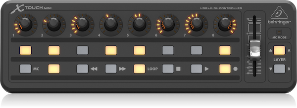

# X-Toucher



Driver for the Behringer X-Touch Mini MIDI controller.

## Install

```bash
npm install
```

## Starting Development

Start the app in the `dev` environment:

```bash
npm start
```

## Packaging for Production

To package apps for the local platform:

```bash
npm run package
```

## License

MIT © [Patrick Hund](https://github.com/pahund)
Based on [Electron React Boilerplate](https://github.com/electron-react-boilerplate)
